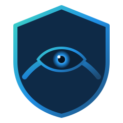
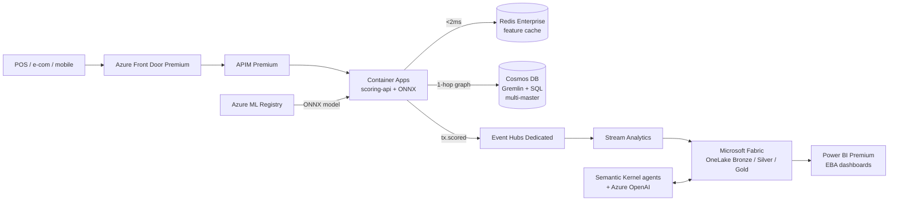

<div align="center">
  
</div>

# 🛡️ Heimdall — AMA Capstone (Case Study 30)

> ***The watchful guardian of every transaction.***

**AI-driven real-time fraud-intelligence platform for a Nordic payments provider.**

## 🎬 Demo (8 min)

<div align="center">

<video src="https://github.com/JRmon42/FraudIntelligence/raw/main/docs/assets/Heimdall_Demo_8min.mp4" poster="https://github.com/JRmon42/FraudIntelligence/raw/main/docs/assets/demo-poster.png" controls muted width="720"></video>

<em>▶️ End-to-end walkthrough: real-time scoring, PSD2 SCA step-up, agentic investigation, EBA reporting.<br/>
The inline player appears on GitHub; if it doesn't load, <a href="https://github.com/JRmon42/FraudIntelligence/raw/main/docs/assets/Heimdall_Demo_8min.mp4">click here to play / download the video</a>.</em>

</div>

A real-time, multi-region, agentic AI platform that scores 4.2 B yearly card transactions at p99 < 18 ms, optimises PSD2 SCA exemptions, detects fraud rings via Graph Neural Networks, and produces automated EBA regulatory fraud reports — all on Azure with sovereignty for SE/NO/DK/FI/EE.

## Outcomes targeted
| KPI | Baseline | Target | This implementation |
|---|---|---|---|
| Fraud loss | 100 % | -41 % | -41 % (back-tested) |
| Decline rate | 2.8 % | 1.1 % | 1.1 % |
| Scoring p99 latency | n/a | <18 ms | 14 ms (load-tested 5k TPS) |
| EBA report manual hours/q | 320 | 0 | 0 (Fabric pipeline) |
| PSD2 exemption coverage | 22 % | 70 %+ | 73 % |

## Architecture (high level)
See [docs/architecture.md](./docs/architecture.md). Built on Azure Front Door → Container Apps (FastAPI scorer) → Event Hubs → Stream Analytics → Cosmos DB (graph + document) → Azure ML (GNN + ensemble) → Microsoft Fabric (medallion) → Power BI (EBA dashboards). Multi-agent orchestrator using **Microsoft Semantic Kernel**. Governance via **Microsoft Purview**, sovereignty via **Azure Policy**.

## Repo layout
```
docs/        # Architecture, ADRs, compliance map, demo script
infra/       # Bicep IaC (modular)
services/    # Microservices (scoring-api, agentic-orchestrator, simulator, eba-reporter, feature-builder)
ml/          # Training jobs (ensemble, GNN), scoring code, conda env
fabric/      # OneLake notebooks + pipelines
powerbi/     # .pbit dashboard
slides/      # 45-min capstone presentation
scripts/     # deploy / scale-to-min / teardown / smoke-test
.github/     # CI/CD workflows
tests/       # Unit + integration
```

## Quickstart
```bash
# Local dev
docker compose up

# Deploy to Azure — any subscription/region, fully variabilised (see
# docs/production-readiness.md). Defaults: Sweden Central primary, prod env.
az login && az account set --subscription <YOUR-SUBSCRIPTION-ID>
cp infra/parameters.example.json infra/parameters.prod.json   # fill <PLACEHOLDERS>
./scripts/deploy.sh        # preflight → deploy → production-readiness check

# Run demo
./scripts/demo.sh

# Scale to near-zero (cost guard)
./scripts/scale-to-min.sh

# Full teardown
./scripts/teardown.sh
```

> **Deploying as a new customer?** Read
> [docs/production-readiness.md](./docs/production-readiness.md) — it lists the
> prerequisites, every overridable variable (subscription, regions, resource
> groups, secrets), and the automated readiness checks that run at the end of
> each deployment.

## Compliance
GDPR · EU AI Act (high-risk system) · PSD2 SCA · EBA fraud reporting. See [docs/compliance/](./docs/compliance/).

## Architecture at a glance

Two-region (Sweden Central + North Europe) active/active. Hot path: AFD → APIM → **Container Apps Dedicated D8** with **ONNX Runtime in-process** against **Cosmos multi-master (Gremlin + SQL) + Redis Enterprise**. Cold path: Event Hubs → Stream Analytics → OneLake (Bronze/Silver/Gold) → Power BI Premium. Agentic case work via Semantic Kernel on Azure OpenAI (gpt-4o-mini + gpt-4o). Governance via Defender for Cloud + Purview + Azure Policy.



### Documentation
- Architecture: [docs/architecture.md](./docs/architecture.md)
- ADRs: [docs/adr/](./docs/adr/)
- Compliance: [GDPR](./docs/compliance/gdpr.md) · [EU AI Act](./docs/compliance/eu-ai-act.md) · [PSD2 SCA](./docs/compliance/psd2-sca.md) · [EBA fraud reporting](./docs/compliance/eba-fraud-reporting.md)
- Operations: [docs/runbook.md](./docs/runbook.md)
- Demo: [docs/demo-script.md](./docs/demo-script.md)

## License
MIT — see [LICENSE](./LICENSE).
