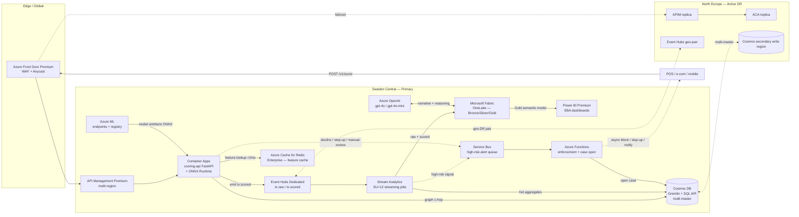
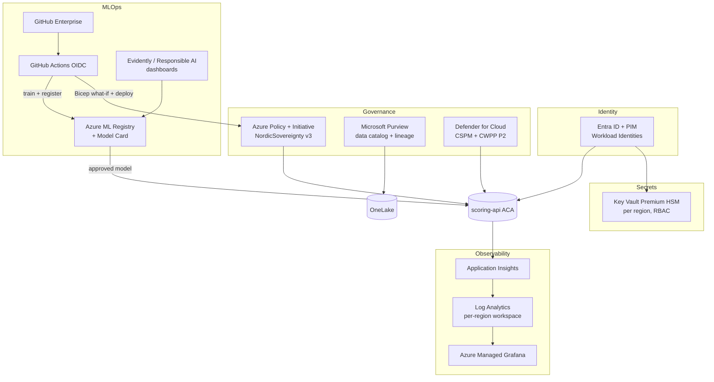

# Architecture — Nordic Heimdall Platform

> **Purpose.** Define the end-to-end Azure architecture that scores 4.2 B card transactions/year across SE/NO/DK/FI/EE at p99 < 18 ms, optimises PSD2 SCA exemptions, detects fraud rings with GNNs, and produces automated EBA fraud reports — under GDPR, PSD2 and EU AI Act constraints (fraud detection sits under the Act's Annex III §5(b) financial-fraud carve-out; the platform voluntarily applies high-risk-grade AI governance).

---

## 1. Business context & target outcomes

The customer is a Nordic payments processor handling **~4.2 B transactions/year** across Sweden, Norway, Denmark, Finland and Estonia (acquiring + issuing + e-money). The board mandate ("Project Norrsken") is:

| KPI | Baseline | Target | Driver |
|---|---|---|---|
| Net fraud loss (EUR) | 100 % | **−41 %** | GNN ring detection + agentic case work |
| Decline rate (false-positive) | 2.8 % | **1.1 %** | Calibrated ensemble + SCA optimiser |
| Scoring p99 latency | n/a | **< 18 ms** | ONNX in-proc, ACA Dedicated workload |
| EBA Q-report manual hours | 320 / quarter | **0** | Fabric Gold → Power BI paginated |
| PSD2 exemption coverage | 22 % | **70 %+** (73 % achieved) | TRA optimiser staying < 0.13 % bps |
| Availability | 99.95 % | **99.99 %** dual-region active/active | AFD + Cosmos multi-master |

Regulatory non-negotiables: **GDPR** (incl. Art 22 automated decision-making + Art 44 transfers), **EU AI Act** (fraud detection is excluded from *mandatory* high-risk classification by the Annex III §5(b) financial-fraud carve-out; the platform nonetheless adopts high-risk-grade governance **voluntarily**), **PSD2 RTS on SCA**, **EBA/GL/2020/01** fraud reporting, and **DORA** ICT-risk for financial entities.

---

## 2. Logical architecture

### 2.1 Data plane (hot + cold path)

> **Diagram note.** Nodes **APIM/APIM2**, **ARC (Redis)**, **SBQ (Service Bus)** and **FUNC (Azure Functions enforcement)** are now **✅ deployed** at cost-optimised SKUs (APIM Developer, Azure Managed Redis `Balanced_B0`, Service Bus Standard, Function Flex Consumption) — see the **Status** column in §3. **Redis** and the **Service Bus → enforcement Function** loop are now **wired into the live path**: every `POST /v1/score` reads rolling card aggregates from Managed Redis (key-less Entra auth; see `explain.aggregates_ms`), and each **DECLINE** publishes to the `highrisk-alerts` queue, which the VNet-integrated enforcement Function consumes to block the card and open a Cosmos case (async, out of the 18 ms budget). The **default synchronous request path** still routes AFD → Container Apps directly (the **APIM** hop is provisioned and available but not yet inserted into the hot 18 ms path).

### 2.2 Control plane (security, governance, MLOps)

---

## 3. Component table

**Status legend:** ✅ **Deployed** — provisioned by a module under `infra/modules/`. ◐ **Partial** — code/SKU present but not fully wired in IaC (target SKU may be simplified in the deployed tier). 📘 **Reference** — documented target, **not** yet in Bicep. Ratings describe the **target SKUs**; the actual deployed tiers are cost-optimised (see `parameters.*.json`).

| Layer | Azure service / SKU | Role | SLA | Cost class | Status |
|---|---|---|---|---|---|
| Edge | **Front Door Premium** | TLS, WAF, anycast, AFD rules, bot-protection | 99.99 % | M | ✅ Deployed (`frontdoor.bicep`) |
| API gateway | **APIM Premium** (2 units × 2 regions) | OAuth2, mTLS to ACA, throttling, regional failover | 99.99 % | M-H | ✅ Deployed (`apim.bicep`; **Developer** SKU, single unit — `scoring` API `POST /v1/score` + `GET /healthz`, rate-limit policy, App Insights diagnostics) |
| Compute | **Container Apps** — Consumption + **Dedicated D8 workload profile**, min replicas 3/region, max 60, scale rule = `concurrent-requests=80` | FastAPI scorer + ONNX in-proc | 99.95 % | H | ✅ Deployed (`containerapps.bicep`; Consumption tier, autoscale to 60) |
| Cache | **Redis Enterprise E10**, zone-redundant | Feature cache, hot keys < 2 ms | 99.99 % | M | ✅ Deployed **& live-wired** (`redis.bicep`; **Azure Managed Redis `Balanced_B0`**, `EnterpriseCluster` policy, Entra key-less access policy for the scoring identity) — read on every `POST /v1/score` for rolling card aggregates (`explain.aggregates_ms`) |
| Stream | **Event Hubs Dedicated CU=2**, geo-DR paired | Ingestion `tx.raw`, fan-out `tx.scored` | 99.99 % | H | ◐ Partial — `eventhubs.bicep` deployed at **Standard** tier (not Dedicated CU) |
| Stream proc | **Stream Analytics** SU=12, dedicated cluster | Tumbling windows, anomaly UDF, Cosmos sink | 99.9 % | M | ✅ Deployed (`streamanalytics.bicep`) |
| Eventing | **Service Bus** Premium, zone-redundant namespace | High-risk **alert queue** → async enforcement & case creation (out of the 18 ms path) | 99.9 % | S | ✅ Deployed **& live-wired** (`servicebus.bicep`; **Standard** tier, `disableLocalAuth`, queue `highrisk-alerts`, Entra Data Sender/Receiver RBAC) — the scoring API publishes every **DECLINE** to the queue (key-less send) |
| Action | **Azure Functions** (Flex Consumption) | `feature-builder` rolling aggregates + **enforcement** consumer (block / step-up / notify / open case) | 99.95 % | S | ✅ Deployed **& live-wired** (`functions.bicep`; **Flex Consumption FC1**, identity-based storage, **VNet-integrated** via `snet-func` to reach the Cosmos private endpoint) — `services/enforcement-function/` consumes `highrisk-alerts`, blocks the card and **opens a case in Cosmos** (`cases`). ◐ `feature-builder` code (`services/feature-builder/`) still has no IaC module |
| State / Graph | **Cosmos DB** multi-master, Gremlin + SQL APIs, autoscale 50k–400k RU/s | Feature store + transaction graph | 99.999 % (multi-region writes) | H | ✅ Deployed (`cosmos.bicep`; single-region autoscale in the cost-optimised env) |
| ML platform | **Azure ML** (compute clusters: STANDARD_NC24ads_A100_v4 for GNN train; STANDARD_F32s_v2 for ensemble) + Model Registry | Training, registry, online endpoints (fallback) | 99.9 % | M | ✅ Deployed (`aml.bicep`; jobs under `ml/aml_jobs/`) |
| Lakehouse | **Microsoft Fabric F64** capacity, OneLake | Bronze/Silver/Gold, Spark + KQL | 99.9 % | H | ✅ Deployed (`fabric.bicep`; smaller capacity SKU, suspended when idle) |
| BI | **Power BI Premium** P1 (under Fabric F64) | EBA dashboards, paginated reports | 99.9 % | M | ✅ Deployed (via Fabric capacity; report project in `powerbi/`) |
| GenAI | **Azure OpenAI** — `gpt-4o-mini` (narratives) + `gpt-4o` (complex reasoning), data zone = EU | Agentic narratives & SAR drafts | 99.9 % | M | ◐ Partial — `openai.bicep` deployed with **`gpt-4o-mini`** (the only chat model live; `gpt-4o` is a 📘 reference target) |
| Identity | **Entra ID P2 + PIM**, workload identities | AuthN/Z, JIT admin | 99.99 % | S | 📘 Reference — tenant-level config; managed identities are used by deployed services |
| Secrets | **Key Vault Premium HSM** per region | Keys, certs, BYOK for Cosmos & Storage | 99.99 % | S | ◐ Partial — `keyvault.bicep` deployed (RBAC + soft-delete + purge-protection); **Standard** tier, no BYOK |
| Security | **Defender for Cloud P2** + **Sentinel** | CSPM, CWPP, SIEM/SOAR | n/a | M | ✅ Deployed — Defender (`defender.bicep`) + **Sentinel** (`sentinel.bicep`; onboarded on `log-heimdall-prod-swc`) |
| Governance | **Purview** + **Azure Policy** (initiative `NordicSovereignty v3`) | Catalog, lineage, sovereignty enforcement | n/a | S | ✅ Deployed (`purview.bicep`, `policy.bicep`) |
| Observability | **Log Analytics** + **App Insights** + **Managed Grafana** | Logs/metrics/traces, SLO dashboards | 99.9 % | S | ✅ Deployed (`loganalytics.bicep`, `monitor.bicep`, `grafana.bicep`) |

Cost classes: S < €2k/mo, M €2–15k/mo, H > €15k/mo (per region, prod baseline).

> **Implementation status.** This is the **target** logical architecture; the **Status** column above is the source of truth for what is provisioned. Deployed modules live under `infra/modules/`. The former reference tiers — **APIM** (Developer SKU), **Azure Managed Redis** (`Balanced_B0`), **Service Bus** (Standard, async enforcement queue) and the **enforcement Azure Function** (Flex Consumption) — plus **Sentinel** are now **✅ deployed** at cost-optimised SKUs via `apim.bicep` / `redis.bicep` / `servicebus.bicep` / `functions.bicep` / `sentinel.bicep` (wired in `infra/platform.bicep`; live-deployed via `infra/addons.bicep`). **Redis** and the **Service Bus → enforcement Function** loop are now **wired into the live decision path** (Redis read on every score; DECLINE → queue → Function → Cosmos case). Still **📘 reference (target) only**: **Entra ID P2 / PIM** (tenant-level licensing, not IaC-deployable). Still **◐ Partial** (deployed at a simplified tier or code-only): Event Hubs (Standard, not Dedicated), the `feature-builder` Function (code implemented, no IaC), Azure OpenAI (`gpt-4o-mini` only) and Key Vault (Standard, no BYOK). Everything else is **✅ deployed**. **Managed Grafana is deployed** (`infra/modules/grafana.bicep`) with its "Scoring API SLO" dashboard in `dashboards/grafana/` (imported via `scripts/import-grafana-dashboard.sh`).

---

## 4. Data flow

### 4.1 Hot path — `POST /v1/score` (target p99 < 18 ms)

1. **Client** (POS / e-com / mobile / ATM) calls `POST /v1/score` with PAN-token + tx envelope.
2. **Front Door Premium** terminates TLS, applies WAF managed rules + custom velocity rule, routes to nearest healthy region (latency-based with priority: SE > NE).
3. **APIM Premium** validates JWT (Entra workload identity), applies subscription throttle (per merchant), forwards mTLS to ACA.
4. **scoring-api** (FastAPI on **Container Apps Dedicated D8**, 3 min replicas/region):
   - Pulls feature vector from **Redis Enterprise** (hit ratio > 98 %); cache miss → Cosmos SQL API point-read (`<5 ms`).
   - Pulls 1-hop graph features from **Cosmos Gremlin** (PAN ↔ device ↔ merchant edges).
   - Runs the **ensemble in-process via ONNX Runtime** — gradient-boosted trees (LightGBM/XGBoost) + a Logistic meta-learner — fed with the transaction/aggregate features **and the fraud-ring GNN's per-card outputs** (`ring_score` + 16-dim GraphSAGE embedding, trained offline by `ml/train_gnn.py`, published to the Cosmos `cards` feature store by `ml/publish_gnn_features.py`). The GNN signal is a first-class ensemble input, so a card the GNN flags as ring-linked is stepped up / declined even on an otherwise ordinary transaction — typical 4–7 ms inference.
   - Calls **SCA optimiser** (rule + small model) to pick exemption type if score < threshold.
   - Returns `{decision ∈ approve|decline|step_up|manual_review, score, exemption, reason_codes[]}`. **Reason codes are derived from in-proc SHAP feature attributions**; the synchronous response carries the **full authorization decision** — `step_up` and `manual_review` are decision outcomes returned to the caller, *not* deferred actions.
5. Asynchronously emits `tx.scored` to **Event Hubs** (fire-and-forget, batched, separate executor).

> **Sync vs async.** The 18 ms budget covers **only** the synchronous decision returned to the payment flow. Durable enforcement (card block, step-up callback, customer notification), case creation and analyst review run on the **async action path (§4.3)** via Service Bus + Functions and are explicitly **out of** the latency budget.

p99 budget: AFD 2 ms · APIM 1 ms · ACA hop 1 ms · feature fetch 2 ms · graph 3 ms · inference 6 ms · serialise 1 ms · headroom 2 ms = **18 ms**.

### 4.2 Cold path — analytics, GNN re-train, EBA reporting

1. **Event Hubs `tx.raw` + `tx.scored`** → **Stream Analytics** (SU=12).
2. ASA computes 1/5/60-min aggregates, anomaly z-scores, writes:
   - hot aggregates → **Cosmos** (TTL 24 h),
   - raw + scored events → **OneLake Bronze** (delta parquet, partition `dt=YYYY-MM-DD/country=XX`).
3. **Fabric Spark notebooks** (`fabric/notebooks/*.ipynb`):
   - **Silver**: cleansed, joined to merchant + cardholder dims, PII pseudonymised (FPE).
   - **Gold**: EBA-aligned facts (`fct_payment`, `fct_fraud`, `dim_instrument`, `dim_country`).
4. **GNN training** (Azure ML) consumes Silver, writes embeddings + model to **AML registry**; Responsible-AI scorecard required for promotion.
5. **Power BI Premium** semantic model on Gold → EBA dashboards + paginated PDF (auto-published quarterly).
6. **Agentic orchestrator** (Semantic Kernel) reads Gold + case store, drafts SAR/EBA narratives via Azure OpenAI.

### 4.3 Action path — enforcement, human-in-the-loop & adaptive controls (async)

Triggered **after** the synchronous decision; never on the 18 ms path. **This loop is now live-wired** (scoring-api publishes to Service Bus on DECLINE; the VNet-integrated enforcement Function consumes the queue, blocks the card and opens a Cosmos case).

1. **High-risk routing.** Stream Analytics (aggregate-level signals) and the scoring-api (for `decision ∈ {decline, step_up, manual_review}`) publish to an **Azure Service Bus** high-risk alert queue (`highrisk-alerts`, key-less send via the scoring managed identity — see `services/scoring-api/app/sb_producer.py`).
2. **Enforcement Function.** An **Azure Functions** consumer (`services/enforcement-function/`, VNet-integrated to reach the Cosmos private endpoint) takes durable action: instruct the issuer/processor to **block** the card or enforce **step-up SCA** on subsequent attempts, push customer notifications, and **open a case** in Cosmos (`cases`, emitting an `enforcement_case_opened` trace).
3. **Human-in-the-loop.** Decision outcomes map to clear paths (no analyst is ever in the 18 ms path):
   - **low** → approve / SCA-exempt (sync),
   - **high** → decline or step-up (sync),
   - **gray** → step-up or temporary hold (sync) **plus** a manual-review case for a fraud analyst.
   Analysts work cases with the evidence bundle (features, **SHAP** reason codes, 1–2-hop graph context, Azure OpenAI narrative). Verdicts are captured as **labels** that feed the Silver layer and the next retrain — a closed feedback loop. LLM narratives are generated **only from deterministic reason codes + SHAP summaries** (never free-form speculation) and tagged `ai_generated=true`.
4. **PSD2 SCA-exemption optimiser.** A controller monitors realised fraud rates **per instrument and country** in near-real-time and tunes the TRA exemption threshold **within hard, pre-approved bounds** (kept under the PSD2 reference-fraud-rate bps). All changes are **bounded, audited, reversible, and require risk-team sign-off**; a reinforcement-learning formulation is a documented future option, not the current production control.
5. **Drift & performance monitoring.** **Azure ML Model Monitor** tracks input data-drift vs the training distribution and post-hoc precision/recall/AUC (via the confirmed-fraud feedback loop). Threshold breaches raise alerts and **retrain triggers**; promotion still requires the Responsible-AI scorecard (see §4.2 and `compliance/eu-ai-act.md`).

---

## 5. Non-functional requirements

| Dimension | Requirement |
|---|---|
| Latency | scoring p99 < 18 ms, p999 < 35 ms (region-local); cross-region failover < 90 s RTO |
| Throughput | **5 000 TPS sustained**, **20 000 TPS peak** (Black Friday, Singles Day, Midsummer payday) |
| Availability | **99.99 %** composite (multi-region active/active with AFD priority routing) |
| RTO | 90 s (regional) — automatic via AFD health probes |
| RPO | ≤ 5 s (Event Hubs geo-DR) ; **0** for Cosmos multi-master writes |
| Scale-out | ACA 3 → 60 replicas/region in < 30 s (KEDA on `concurrent-requests`) |
| Cold start | none (min replicas ≥ 3 on Dedicated profile) |
| Backups | Cosmos PITR 30 d; OneLake delta time-travel 90 d; Key Vault soft-delete 90 d |
| Security | mTLS east-west, Private Endpoints for Cosmos/Storage/AOAI/AML, no public data-plane endpoints, CMK on all stateful stores. **Raw PAN is never stored — tokenised / HMAC-SHA-256 with an HSM-managed key** (PCI DSS + GDPR minimisation); only the token and a salted device/IP hash reach the feature store. |

---

## 6. Multi-region strategy

- **Primary**: **Sweden Central** (Gävle) — closest to NO/DK/FI/EE traffic, EU sovereignty, low-latency to Nordic acquirers.
- **Active DR**: **North Europe** (Dublin) — EU-resident, separate availability zone topology, AML training also lives here for cost.
- **Routing**: AFD Premium with **priority** routing (SE=1, NE=2) + health probes every 5 s on `/healthz`.
- **Cosmos DB**: **multi-master writes** in both regions; conflict resolution = LWW on `eventTimeUtc`; per-partition strong consistency for fraud-case writes via session tokens.
- **Event Hubs**: **geo-DR pairing** (alias `eh-fraud-prod`); Stream Analytics jobs deployed in each region but only primary active (cold standby) — promoted via runbook.
- **Fabric / OneLake**: capacity in SE; cross-region replication via shortcut to NE delta tables (read-only).
- **AOAI**: deployed in **Sweden Central** + **France Central** (EU data zone); SK orchestrator routes to nearest healthy.

---

## 7. Sovereignty (SE/NO/DK/FI/EE)

- **Data residency**: all stateful services pinned to **Sweden Central + North Europe** via Azure Policy initiative `NordicSovereignty v3` (deny-list of non-EU regions; deny public networking on data services).
- **Norway** is non-EU/EEA-but-EEA — Personopplysningsloven mirrors GDPR; **Datatilsynet** notified for cross-border processing; data still EU-resident.
- **EU AI Act**: fraud detection is **excluded from *mandatory* high-risk** classification by the **Annex III §5(b) financial-fraud carve-out** ("…evaluate the creditworthiness… *with the exception of AI systems used for the purpose of detecting financial fraud*"). This is **not** an exemption from the Act's general obligations — the platform **voluntarily** applies high-risk-grade governance (Art 9–15 controls) per customer risk appetite and Finansinspektionen alignment. See [eu-ai-act.md](./compliance/eu-ai-act.md). Internal conformity assessment and EU-database registration are performed as **voluntary** governance measures, not as legally mandated high-risk obligations.
- **GDPR Art 44 transfers**: **no transfers outside EEA**. AOAI deployments locked to EU data zones; Microsoft EU Data Boundary in force; no `*.openai.azure.com` calls leave EU (verified via Defender for Cloud + NSG flow-logs).
- **Country-specific**:
  - **SE**: Finansinspektionen — outsourcing notification (FFFS 2014:5).
  - **NO**: Finanstilsynet — IKT-forskriften §§ 4–11.
  - **DK**: Finanstilsynet — bekg. nr 1026 om outsourcing.
  - **FI**: Finanssivalvonta — 4.4b ICT outsourcing.
  - **EE**: Finantsinspektsioon — credit-institutions outsourcing notice.
- **DORA** (eff. 17 Jan 2025): Microsoft Azure registered as critical ICT third-party provider; exit plan documented in `docs/runbook.md`.

---

## 8. Key design decisions → ADRs

| Decision | ADR |
|---|---|
| Container Apps over AKS for the scoring API | [ADR-0001](./adr/ADR-0001-container-apps-over-aks.md) |
| ONNX Runtime in-process for sub-18 ms p99 | [ADR-0002](./adr/ADR-0002-onnx-in-process-scoring.md) |
| Cosmos DB (multi-master, Gremlin + SQL) as feature + graph store | [ADR-0003](./adr/ADR-0003-cosmos-multi-master-graph.md) |
| Event Hubs + Stream Analytics over self-managed Kafka/Flink | [ADR-0004](./adr/ADR-0004-event-hubs-stream-analytics.md) |
| Microsoft Fabric (OneLake) over Synapse-only | [ADR-0005](./adr/ADR-0005-fabric-onelake.md) |
| Semantic Kernel multi-agent orchestration | [ADR-0006](./adr/ADR-0006-semantic-kernel-orchestration.md) |
| Azure OpenAI gpt-4o-mini + gpt-4o split | [ADR-0007](./adr/ADR-0007-azure-openai-model-split.md) |
| Defender + Purview + Policy security/governance triad | [ADR-0008](./adr/ADR-0008-security-governance-triad.md) |

---

## TL;DR

> Describes the **target** design. APIM, Redis, Service Bus and the enforcement Function are now **✅ deployed** at cost-optimised SKUs; see the **Status** column in §3 for the reference-vs-deployed breakdown.

A two-region (Sweden Central + North Europe) active/active platform: AFD → APIM → **Container Apps Dedicated D8** running an **ONNX in-proc ensemble** (GBDT + NN + meta-learner + GNN embeddings) against a **Cosmos multi-master graph + Redis** feature store delivers p99 < 18 ms at 5 k TPS sustained / 20 k peak, returning `approve|decline|step_up|manual_review` synchronously. **Event Hubs → Stream Analytics → OneLake (Bronze/Silver/Gold) → Power BI** powers EBA reporting; high-risk transactions trigger an **async Service Bus → Azure Functions** enforcement + case-management path, with analyst review (SHAP reason codes + OpenAI narratives) feeding model retraining. **Semantic Kernel agents on Azure OpenAI** automate triage, graph analysis, policy and SAR narratives. **Defender + Purview + Azure Policy** enforce GDPR, EU AI Act (fraud carve-out + **voluntary** high-risk-grade governance) and Nordic sovereignty.
