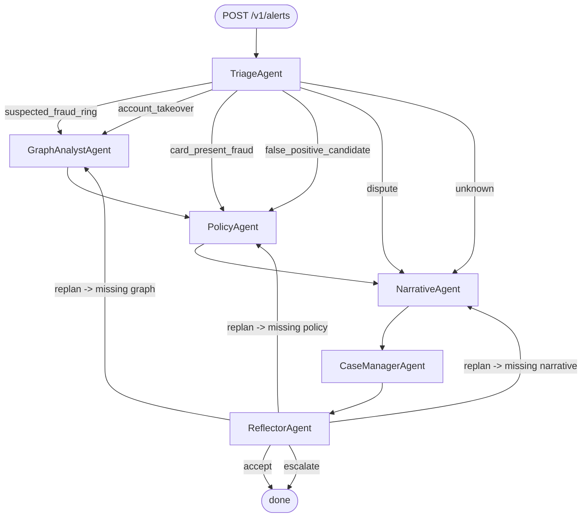

# FraudIntelligence — Agentic Orchestrator

A multi-agent service that handles fraud alerts via a coordinated workflow with
**autonomy, planning, reflection, and tool use**. Built for the
FraudIntelligence platform and designed to score *Excellent* on the AMA rubric
for both *Autonomy and orchestration* and *Multi-agent coordination*.

---

## Highlights

| Capability | How it is implemented |
| --- | --- |
| **Autonomous planning** | `Planner` (in `app/planner.py`) selects the next agent at every step from (a) explicit handoffs, (b) classification-conditional DAG edges and (c) reflection verdicts — never a hard-coded sequence. |
| **Multi-agent coordination** | Six single-responsibility agents (`app/agents/`) sharing a typed `WorkflowState`, each producing an `AgentResult` with an optional `next_agent` handoff and `reason`. |
| **Reflection** | `ReflectorAgent` performs gap analysis after each loop and can request another pass within a configurable `reflection_budget`. |
| **Tool use** | External capabilities (Cosmos Gremlin traversal, PSD2 SCA evaluator) are registered as Semantic Kernel kernel functions in `app/tools.py`. |
| **Telemetry** | Every agent step is wrapped in an OTEL span; `span_id` is persisted on the case timeline for end-to-end traceability. |
| **Offline mode** | `--mock-llm` and `--mock-cosmos` swap Azure dependencies for deterministic stubs, so tests and demos run without credentials. |

---

## State graph



The reflection loop is bounded by `reflection_budget` (default 2) — once
exhausted the case is marked `escalated` so a human reviewer can pick it up.

---

## Agents

| Agent | Responsibility | External tools |
| --- | --- | --- |
| `TriageAgent` | Classifies the alert and proposes the initial plan | — |
| `GraphAnalystAgent` | Pulls a 2-hop neighbourhood from Cosmos Gremlin | `graph_two_hop` |
| `PolicyAgent` | Maps findings to PSD2 SCA exemptions and EBA categories | `evaluate_sca` |
| `CaseManagerAgent` | Persists the case and timeline in Cosmos DB SQL API | `case_upsert` / `case_get` |
| `NarrativeAgent` | Drafts SAR + EBA narratives via Azure OpenAI gpt-4o | — |
| `ReflectorAgent` | Reviews state for completeness and may demand a replan | — |

Each agent inherits from `app/agents/base.py:Agent`, which guarantees:

* `run(state) -> AgentResult` never raises (errors are surfaced on the result)
* every call emits an OTEL span and a timeline entry
* `tools` property exposes the agent's tool surface for `GET /v1/agents`

---

## API

| Method | Path | Purpose |
| --- | --- | --- |
| `POST` | `/v1/alerts` | Enqueue an alert and run the workflow → returns `case_id` |
| `GET`  | `/v1/cases/{case_id}` | Full case state, timeline, narratives |
| `POST` | `/v1/cases/{case_id}/replay` | Re-run with a fresh reflection budget |
| `GET`  | `/v1/agents` | Agent + tool metadata (used by the demo console) |
| `WS`   | `/v1/cases/{case_id}/events` | Live agent-step stream |
| `GET`  | `/healthz` | Liveness probe |

---

## Running

### Local (no Azure required)

```bash
cd services/agentic-orchestrator
pip install -e ".[dev]"

# Serve
python -m app.main --mock-llm --mock-cosmos --port 8080

# Or run the canonical demo (prints the timeline of the fraud-ring scenario)
python -m app.demo
```

### Tests

```bash
pytest -q
```

All tests run with the deterministic mock LLM — no Azure credentials needed.

### Docker

```bash
docker build -t fi-agentic-orchestrator .
docker run --rm -p 8080:8080 -e MOCK_LLM=true -e MOCK_COSMOS=true fi-agentic-orchestrator
```

### Production configuration

Copy `.env.example` to `.env` and set the Azure OpenAI / Cosmos / Gremlin
endpoints. Set `MOCK_LLM=false` and `MOCK_COSMOS=false`.

---

## Demo script

```bash
python -m app.demo
```

Output (abridged):

```
=== FraudIntelligence Agentic Orchestrator — DEMO ===
Alert: alert-... amount=487.55 EUR reasons=['velocity', 'shared_device', 'mcc_anomaly']

--- Timeline ---
 1. [...] TriageAgent          classified=suspected_fraud_ring; plan=[...]
 2. [...] GraphAnalystAgent    2-hop neighbourhood: 7 nodes / 10 edges, anomaly_score=0.91
 3. [...] PolicyAgent          SCA applied=[] blocked=['low_value', 'trusted_beneficiary'] EBA=['fraud_card_not_present', 'organised_fraud']
 4. [...] NarrativeAgent       narratives drafted (sar=..b, eba=..b)
 5. [...] CaseManagerAgent     case persisted: case-... (status=open)
 6. [...] ReflectorAgent       verdict=accept; next=None

Final classification: suspected_fraud_ring
Visited agents: TriageAgent -> GraphAnalystAgent -> PolicyAgent -> NarrativeAgent -> CaseManagerAgent -> ReflectorAgent
```

---

## Project layout

```
services/agentic-orchestrator/
├── pyproject.toml
├── Dockerfile
├── README.md
├── .env.example
├── app/
│   ├── __init__.py
│   ├── main.py            # uvicorn entrypoint + CLI
│   ├── api.py             # FastAPI router + WS
│   ├── state.py           # Pydantic state models
│   ├── planner.py         # autonomous DAG planner
│   ├── tools.py           # SK kernel-function registrations
│   ├── llm.py             # Azure OpenAI + MockLLM
│   ├── cosmos.py          # SQL + Gremlin clients (+ in-memory mocks)
│   ├── telemetry.py       # OTEL spans + structured logging
│   ├── demo.py            # offline end-to-end demo
│   └── agents/
│       ├── base.py
│       ├── triage.py
│       ├── graph_analyst.py
│       ├── policy.py
│       ├── case_manager.py
│       ├── narrative.py
│       └── reflector.py
├── tests/
│   ├── conftest.py
│   ├── test_planner.py
│   ├── test_agents.py
│   └── test_workflow_e2e.py
└── examples/
    ├── sample_alert.json
    └── expected_narrative.md
```
